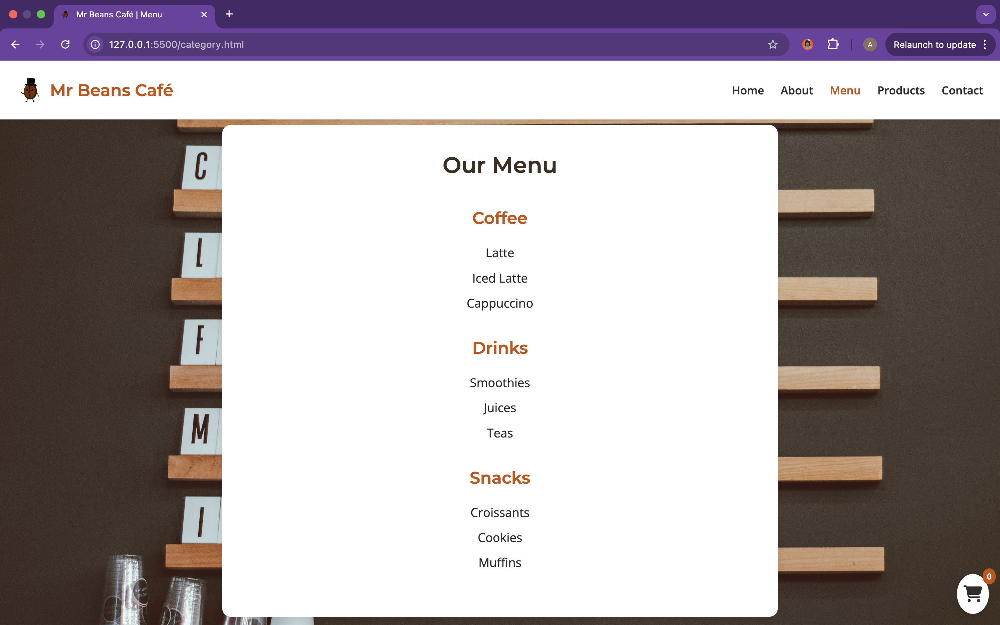
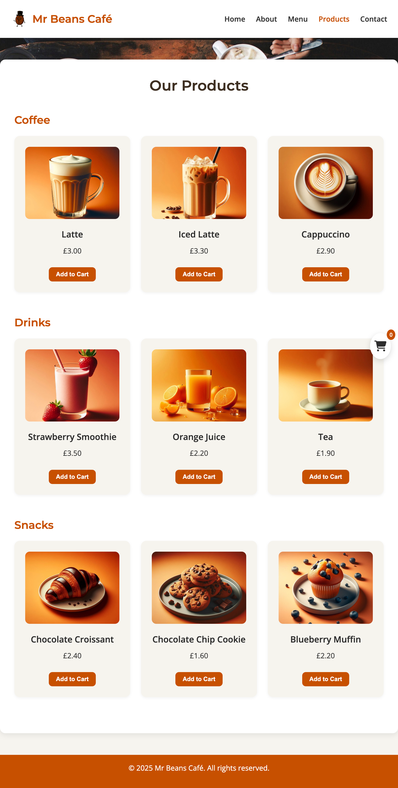
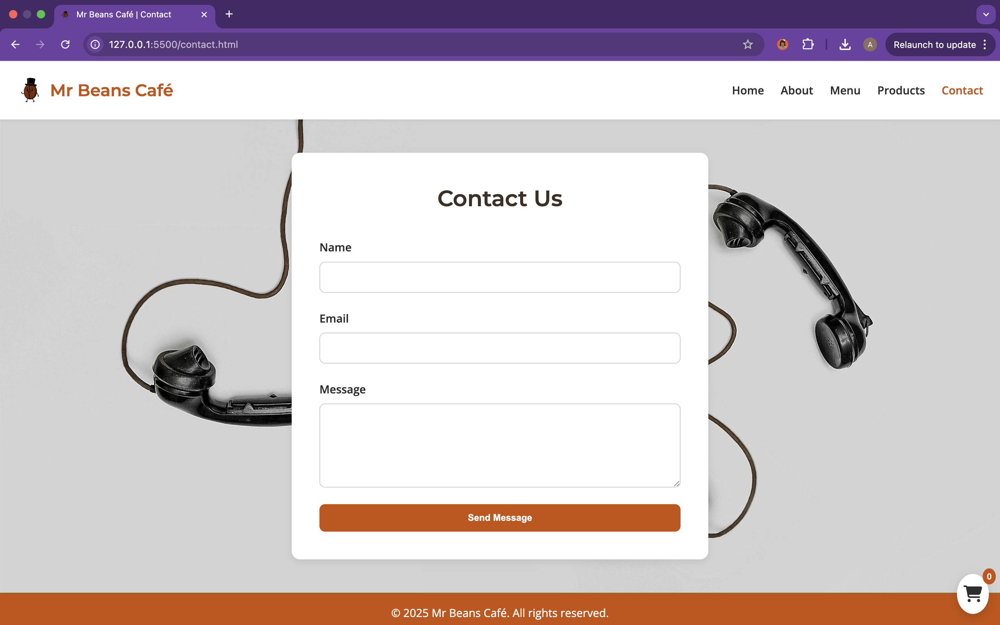

# ☕ Mr Beans Café

Welcome to the official website for **Mr Beans Café** — a cozy-modern fictional café experience designed to showcase clean UI, responsive layouts, and interactive functionality built using **HTML, CSS, and JavaScript**.

## 🌐 Live Demo

🔗 [Visit the website](https://AlfieCross.github.io/Project-2-Cafe-Website/)  
> _Deployed with GitHub Pages_

---

## 📌 Project Overview

This project was created as part of a front-end development portfolio to demonstrate:
- Clean and responsive design
- JavaScript interactivity (shopping cart, form handling)
- Accessibility and UX best practices
- File structure and code documentation
- Deployment using GitHub Pages

---

## 🎯 Features

- ✅ Responsive navigation bar with hamburger menu for mobile
- ✅ Interactive shopping cart with localStorage persistence
- ✅ Filtered menu and categorized product layout
- ✅ Contact form with client-side validation
- ✅ Semantic HTML with ARIA attributes
- ✅ Accessible design with color contrast and keyboard navigation

---

## 🖼️ Screenshots

  
  
  
  


---

## 🧱 Technologies Used

- **HTML5** – Semantic structure and accessible content
- **CSS3** – Responsive design, media queries, card layouts
- **JavaScript (ES6)** – Interactive functionality (cart, nav, form)
- **Google Fonts** – Montserrat & Open Sans
- **Font Awesome** – Icons for cart and menu
- **Pexels** - For background images

---

## 🗂️ Project Structure

```
Project-2-Cafe-Website/
│
├── index.html
├── about.html
├── category.html
├── products.html
├── contact.html
│
├── css/
│   └── styles.css
│
├── js/
│   └── script.js
│
├── assets/
│   ├── images/         ← Product & background images
│   └── screenshots/    ← Screenshots for README
│
└── README.md
```

---

## ✅ Testing & Validation

- **HTML**: Passed W3C Validator – no errors
- **CSS**: Passed Jigsaw CSS Validator – no issues
- **JavaScript**: Checked manually in DevTools – no console errors
- **Links Tested**: All navigation and cart buttons tested across all pages
- **Responsive Design**: Tested via Chrome, Firefox, and mobile view using DevTools

✔️ All code manually tested for usability, responsiveness, and accessibility.

---
